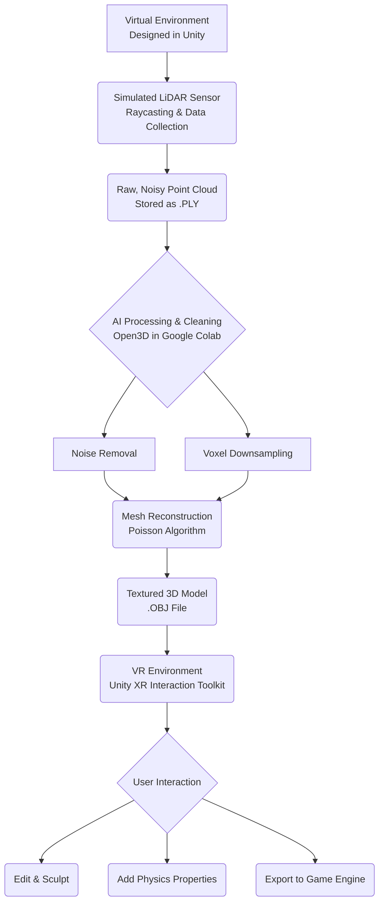

Of course. Here is a professional, detailed, and impressive `README.md` file for your GitHub repository. This is designed to be copied directly, customized with your own links, and will immediately catch the eye of recruiters.

---

# VR SimuScan: Embedded AI for Real-Time 3D Reconstruction in VR


## 📖 Project Overview

**VR SimuScan** is a simulation-based prototype that explores the hardware-software co-design of next-generation VR/AR headsets. This project demonstrates a complete pipeline for **real-time 3D environment capture, AI-enhanced processing, and interactive model refinement** entirely within a simulated environment, showcasing the potential of **Embedded AI** for on-device perception tasks.

The system simulates a VR headset (like Meta Quest Pro) enhanced with external LiDAR and RGB sensors. It captures a virtual environment, processes the noisy sensor data using computer vision and machine learning techniques, reconstructs a clean, textured 3D mesh, and allows for direct manipulation of the model within the VR space—all without any physical hardware.

**Key Innovation:** Simulating the entire embedded perception stack (sensors → AI → 3D model → user interaction) to prove the viability of real-time, high-fidelity scanning for accelerating VR/AR content creation pipelines.

---

## 🎯 Key Features & Demo

*   **Real-Time LiDAR Simulation:** A custom raycasting system that mimics the behavior and noise patterns of a physical rotating LiDAR sensor.
*   **AI-Powered Data Cleaning:** Leveraging Open3D and custom algorithms for statistical outlier removal and voxel downsampling.
*   **3D Mesh Reconstruction:** Conversion of noisy point clouds into clean, watertight meshes using Poisson surface reconstruction.
*   **Simulated Embedded AI:** A proof-of-concept for on-device inference, classifying objects directly from point cloud data within the Unity simulation using a lightweight model.
*   **VR Integration & Interaction:** Import reconstructed models into a VR environment for intuitive manipulation, scaling, and inspection using simulated motion controllers.
*   **End-to-End Asset Pipeline:** Export final models in standard formats (`.obj`, `.fbx`) ready for use in game engines like Unity and Unreal.

**🔬 Live Demo Video:** [Insert Your YouTube or Loom Demo Video Link Here]

---

## 🏗 System Architecture

The project follows a multi-stage pipeline, simulating the data flow from physical sensors to a final, interactive asset:



---

## 🛠️ Technology Stack

| Component | Technology Used |
| :--- | :--- |
| **VR Simulation & Rendering** | Unity Engine, XR Interaction Toolkit, XR Device Simulator, ProBuilder |
| **Programming** | C# (Unity Scripting), Python (Data Processing) |
| **3D Processing & AI** | Open3D Library, Poisson Reconstruction, Statistical Outlier Removal |
| **Cloud Processing** | Google Colab (For GPU-accelerated Python code) |
| **3D Modeling & Export** | Blender |
| **Version Control** | Git, GitHub |

---

## 📦 Installation & Usage

### Prerequisites
1.  **Unity Hub** and **Unity Editor 2022.3 LTS** or newer.
2.  **Python 3.8+** and basic libraries (`open3d`, `numpy`).
3.  (Optional) **Blender** for advanced model editing.

### Steps to Run the Simulation
1.  **Clone the Repository:**
    ```bash
    git clone https://github.com/your-username/VR-Scanning-Simulator.git
    cd VR-Scanning-Simulator
    ```

2.  **Open the Unity Project:**
    *   Open Unity Hub.
    *   Click `Add`, and select the `VR-Scanning-Simulator` folder.
    *   Open the project with the recommended Unity version.

3.  **Install Project Dependencies:**
    *   The project should automatically import the XR Interaction Toolkit. If not, go to `Window > Package Manager` and install it.
    *   Import the "Starter Assets" and "XR Device Simulator" samples from the package.

4.  **Run the Main Scene:**
    *   Navigate to the `Scenes` folder and open the `Main_Simulation` scene.
    *   Press **Play**.
    *   **Controls:**
        *   `WASD`: Move
        *   `Q/E`: Turn
        *   `Mouse`: Look
        *   `Left Mouse Button`: Simulate LiDAR Scan
        *   `S`: Export Point Cloud to `.PLY`
        *   `E`: Run Simulated AI Classification (See console for output)

5.  **Process the Data (Python):**
    *   Find the exported `.PLY` file in the project's root folder.
    *   Upload it to the provided Google Colab notebook: **[Link to Your Colab Notebook]**.
    *   Run all cells to clean the data and reconstruct the mesh.
    *   Download the `output_mesh.obj` file.

6.  **Import and View in Unity/Blender:**
    *   Drag the `output_mesh.obj` file back into your Unity project.
    *   Instantiate it in the scene to see your cleaned, scanned model!

---

## 🧠 For Recruiters: How This Project Demonstrates Key Skills

This project is a direct response to the technical challenges faced in the VR/AR industry, specifically at companies like **Meta, Google, and Apple** working on the metaverse and spatial computing.

*   **Embedded AI / Edge AI:** The simulation of an on-device classification model demonstrates an understanding of the constraints and opportunities of running ML on hardware (e.g., Quest's Snapdragon chip).
*   **Computer Vision & 3D Reconstruction:** Implementing Poisson reconstruction and point cloud processing shows mastery of core CV topics critical for VR/AR perception teams.
*   **Systems Integration:** The project doesn't just demonstrate isolated skills; it shows the ability to make multiple complex technologies (Unity, Python, AI, 3D geometry) work together in a cohesive pipeline.
*   **Simulation-Based Prototyping:** This is a cost-effective and rapid method used by industry leaders to test algorithms before hardware is available. This project proves I can work effectively in such an environment.
*   **Problem Solving:** From adding synthetic sensor noise to solving data transfer between Unity and Python, this project is a log of complex problem-solving.

---

## 📂 Project Structure

```
VR-Scanning-Simulator/
├── Assets/
│   ├── Scripts/                 # All C# scripts for Unity
│   │   ├── Sensors/
│   │   │   └── LidarSimulator.cs
│   │   ├── Utilities/
│   │   │   └── PLYWriter.cs
│   │   └── AI/
│   │       └── SimpleClassifier.cs
│   ├── Scenes/
│   │   └── Main_Simulation.unity
│   └── Prefabs/                 # Point cloud visualizations
├── ProjectSettings/
├── Exported_Data/               # .PLY files from scans (gitignored)
├── Notebooks/
│   └── PointCloud_Processing.ipynb  # Google Colab Notebook
├── Documentation/
│   └── Architecture_Diagram.png
└── README.md
```

---

## 🚀 Future Work & Potential Enhancements

*   Integration of Neural Radiance Fields (NeRF) for photorealistic texture inference.
*   Simulation of stereo cameras for passive depth estimation.
*   A more complex embedded AI model, ported using Unity's Barracuda inference engine.
*   Multi-sensor fusion (e.g., combining IMU data with LiDAR for better pose estimation).
*   Real-time reconstruction within the Unity game loop, eliminating the need for external Python processing.

---

## 👨‍💻 Developer

**Your Name**
*   LinkedIn: [Insert Your LinkedIn Profile URL]
*   Personal Portfolio: [Insert Your Portfolio Website URL]
*   Email: your.email@domain.com

**Acknowledgments:** This project was inspired by the capabilities of the Meta Quest Pro and the research in real-time SLAM and 3D reconstruction. Thanks to the teams behind Unity, Open3D, and Blender for creating incredible open-source tools.

---
